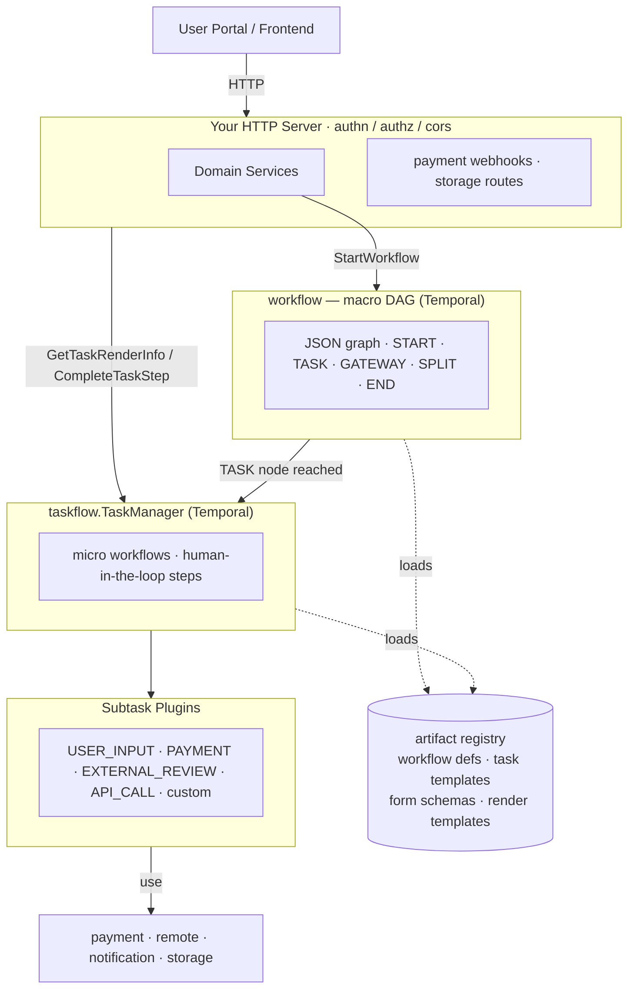

# OpenNSW Core

A Go SDK for building **single window systems** — integrated service portals that orchestrate complex, multi-step government or enterprise workflows across multiple agencies and backend services.

## What is a Single Window System?

A single window system provides citizens or businesses with one portal to complete end-to-end service applications (e.g. trade permits, licensing, consignment approvals) without navigating separate agency websites. Behind the scenes it:

- Runs **long-lived workflows** that span days or weeks
- Coordinates **interactive tasks** where humans submit forms, upload documents, or wait for agency review
- Integrates **payment gateways** for fees and levies
- Calls **external agency services** on the user's behalf
- Renders **dynamic UI** driven by workflow state

This SDK provides all the infrastructure pieces to build such a system, while keeping your domain logic in your own application.

## Packages

| Package | Purpose |
|---|---|
| [`artifact`](artifact/README.md) | Versioned configuration registry — load workflow definitions, form schemas, and templates by ID |
| [`artifactadapter`](artifactadapter/README.md) | Bridge adapters to load domain types (workflow defs, task templates) from the artifact registry |
| [`authn`](authn/README.md) | JWT validation, identity context injection, and HTTP middleware |
| [`authz`](authz/README.md) | Scope-based authorization middleware and predicates, decoupled from authn |
| [`cors`](cors/README.md) | CORS HTTP middleware |
| [`database`](database/README.md) | GORM/PostgreSQL connection factory with pooling and health checks |
| [`notification`](notification/README.md) | Multi-channel notification router (SMS, email) with pluggable providers |
| [`pagination`](pagination/README.md) | Standard pagination envelope and query parameter parsing |
| [`payment`](payment/README.md) | Pluggable payment gateway orchestration with webhook processing and idempotency |
| [`remote`](remote/README.md) | Registry-based outbound HTTP client with pluggable auth (API key, Bearer, OAuth2) |
| [`storage`](storage/README.md) | File storage abstraction (local filesystem and AWS S3) with presigned URLs |
| [`taskflow`](taskflow/README.md) | Micro-interactive task orchestration — the core engine for human-in-the-loop steps |
| [`temporal`](temporal/README.md) | Temporal client factory |
| [`uiprojector`](uiprojector/README.md) | Zone-based, metadata-driven UI rendering from workflow state and business data |
| [`workflow`](workflow/README.md) | JSON DSL-driven Temporal workflow graph interpreter |

## Requirements

- Go 1.26+
- PostgreSQL (via GORM)
- [Temporal](https://temporal.io/) server (for workflow and task orchestration)

## Installation

```sh
go get github.com/OpenNSW/core
```

## Architecture Overview



The two-tier workflow design is central to single window systems:

1. **Macro workflow** (the `workflow` package) — a long-lived Temporal workflow that represents the full service application (e.g. an export permit). It moves through TASK nodes, GATEWAY nodes, and SPLIT nodes according to a JSON graph definition.
2. **Micro workflow** (the `taskflow` package) — each TASK node spawns a short-lived Temporal workflow that presents one interactive step to the user (a form, a payment, an external review). When the user completes the step the micro workflow signals the macro workflow to continue.

---

## Full Wiring Example

The following shows how to assemble the components into a working application (condensed from the reference implementation pattern):

```go
func Build(cfg *Config) (*App, error) {
    // 1. Database
    db, err := database.New(cfg.Database)

    // 2. Artifact registry
    registry := artifact.NewRegistry()
    registry.RegisterLoader("local", local.New("configs"))
    manifest, _ := artifact.LoadManifestFile("configs/manifest.json")
    artifact.RegisterFromConfig(registry, manifest)

    // 3. Payment
    paymentRepo := NewPaymentRepo(db)
    paymentRegistry, _ := payment.NewRegistry("configs/payment_methods.json", map[string]payment.Factory{
        "govpay": govpay.NewGovPayGateway,
    })
    paymentService := payment.NewPaymentService(paymentRepo, paymentRegistry)

    // 4. Temporal client
    temporalClient, _ := temporal.NewClient(cfg.Temporal)

    // 5. Task subsystem
    taskStore := gormstore.New(db)
    pluginRegistry := plugins.NewRegistry()
    pluginRegistry.Register("USER_INPUT",      plugins.NewUserInputPlugin())
    pluginRegistry.Register("PAYMENT",         NewPaymentPlugin(paymentService))
    pluginRegistry.Register("EXTERNAL_REVIEW", NewExternalReviewPlugin(remoteManager))
    pluginRegistry.Register("MY_PLUGIN",       &MyPlugin{})

    assembler, _ := uiprojector.NewAssembler(templateProvider, uiprojector.DefaultProjectors())
    taskRenderer := zoneview.NewTaskRenderer(assembler)

    var tm *orchestrator.TaskManager
    microRunner := workflow.NewTemporalManager(
        temporalClient, "MICRO_WORKFLOW_QUEUE",
        func(p workflow.TaskPayload) (map[string]any, error) { return tm.StartSubTask(ctx, p) },
        func(wfID string, vars map[string]any) error { return tm.HandleTaskCompletion(ctx, wfID, vars) },
    )
    onTaskCompleted := func(parentWorkflowID, parentRunID, parentNodeID string, vars map[string]any) error {
        return consignmentService.HandleTaskCompletion(ctx, parentWorkflowID, parentRunID, parentNodeID, vars)
    }
    tm = orchestrator.NewTaskManager(taskStore, registry, pluginRegistry, microRunner, onTaskCompleted, taskRenderer)
    microRunner.StartWorker()

    // 6. Macro workflow runner
    macroRunner := workflow.NewTemporalManager(
        temporalClient, "INTERPRETER_TASK_QUEUE",
        onMacroTaskActivation, onMacroCompletion,
    )
    macroRunner.StartWorker()

    // 7. Auth
    authnManager, _ := authn.NewManager(userProfileSvc, cfg.Authn)
    authzr, _ := authz.New(func(ctx context.Context) (authz.Principal, bool) {
        ac := authn.GetAuthContext(ctx)
        return ac, ac != nil
    })

    // 8. HTTP
    mux := http.NewServeMux()
    withAuth := authnManager.RequireAuthMiddleware()
    mux.Handle("GET /api/v1/tasks/{id}",  withAuth(authzr.RequireScope("tasks:read")(getTaskHandler(tm))))
    mux.Handle("POST /api/v1/tasks/{id}", withAuth(authzr.RequireScope("tasks:write")(submitTaskHandler(tm))))
    mux.Handle("POST /api/v1/payments/{gatewayId}/webhook", webhookHandler(paymentService))

    return &App{Handler: cors.CORS(cfg.CORS)(mux)}, nil
}
```

## Contributing

Contributions are welcome. See [CONTRIBUTING.md](CONTRIBUTING.md) for local setup,
hooks, the Apache-2.0 license-header policy, and commit conventions.

After cloning, install tools and enable git hooks in one step:

```sh
make setup
```

## License

See [LICENSE](LICENSE).
